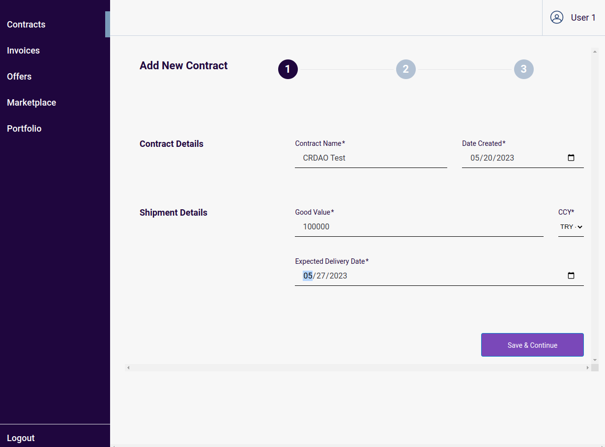

Grant Proposal | [645 - Smart Billing Platform Prototype](https://portal.devxdao.com/public-proposals/645)
------------ | -------------
Milestone | 3
Milestone Title | Backend prototype with frontend - Submission 1
OP | OpenSourceREMarketModel
Reviewer | Gökhan Gurbetoğlu <crdao@ggurbet.com>

# Milestone Details

## Details & Acceptance Criteria

**Details of what will be delivered in milestone:**

- Developing a backend prototype along the user journeys and designing the most important screens.
- The backend prototype will be geared towards providing the functionality covered in the user journeys. It will contain a bridge to the Casper blockchain, allowing in particular the issuance and management of DIDs (tokens).

**Acceptance criteria:**

- An end-to-end backend prototype is built and ready to be demoed to reviewing entities. The most important screens are built (uploaded to GitHub).
- The backend prototype covers at least two of the three main user journeys as described in Milestone #1 but ignores special cases, edge cases, etc. The screens describe the most important elements of a frontend.

**Additional notes regarding submission from OP:**

The above repository contains the link for the code base for the prototype for Milestone 3 of Grant #645.  
The README.md file in the main directory contains detailed explanations for the code base as well as the review and usage process using the UI and API developed for this prototype.

A dedicated review environment has been created. It can be reached at:
The review environment can be reached as follows:

UI: https://app-sbpdxd-m3.shared-dev.noumenadigital.com/login  
API: https://api-sbpdxd-m3.shared-dev.noumenadigital.com  
Swagger: https://api-sbpdxd-m3.shared-dev.noumenadigital.com/swagger/

The users and the password for the environment, as well as the explanations for obtaining an Auth Token for the API are included in the main README.md file.

If there are any questions, please don’t hesitate to reach out.

## Milestone Submission

The following milestone assets/artifacts were submitted for review:

Repository | Revision Reviewed
------------ | -------------
https://github.com/NoumenaDigital/sbp-dxd-m3 | 5b38955

# Install & Usage Testing Procedure and Findings

## Install

In accordance with DEVxDAO's request, there will be no review conducted for the local build and installation procedures in this milestone. This exclusion was explicitly mentioned in the job posting and subsequently communicated with DEVxDAO administrators. Additionally, the reviewer is unable to assess the accuracy and reliability of the installation and execution documentation, despite the presence of detailed instructions in the repository. Therefore, both of these aspects will be designated as Not Applicable in the final assessment table.

## Usage Testing

The testing and evaluation of the prototype were performed on the servers provided by the OP for this purpose. The reviewer used the dedicated review environment to assess the prototype submitted in this milestone.

### Login, Authoriztation & Account Procedures

The reviewer successfully accessed the test review environment specified in the account information table given in the README by following the instructions. Once logged in, the reviewer proceeded to the account page by clicking on the username located in the top right corner. By following link under Casper Account Details, the reviewer was directed to the Casper account page, where they observed the most recent action of adding a delegate right to the Casper DID Management Smart Contract.

The reviewer followed the instructions provided to verify the delegate rights from the Casper Smart Contract. The reviewer navigated to the delegates dictionary within the DID contract. Using the account-hash of the specified user (`user1`), the reviewer searched for it within the dictionary and found that the SBP account-hash is listed as a delegate of the `user1` account.

### Invoice Verification

Following the instructions, the reviewer successfully created an invoice to be offered on the Marketplace by providing the required data. The invoice was then listed on the marketplace, and its details were accessible, including the blockchain reference leading to the invoice's copy on IPFS. Another user could view and purchase the offer, confirming the sale before it appeared in their portfolio. Verifying the invoice's status as the supplier (reviewer) confirmed that it had been marked as paid after being sold to the buyer.

### Smart Billing

After following the instructions, the reviewer successfully created a new contract by entering the contract details and milestones. The contract was then signed and submitted to the Smart Billing Platform. As milestones were reached and marked as completed, invoices were generated and finalized. The contract remained open until all invoices were paid, ensuring the completion of all milestones.

### Invoice Tokenization

Following the provided instructions, the reviewer successfully created an invoice and listed it on the marketplace for potential buyers. The offer details were viewable, including the blockchain reference. By signing in as a different user, the reviewer observed the offer from the buyer's perspective and confirmed the purchase. The purchased offer appeared in the buyer's portfolio, while the invoice's status was updated to "paid" for the supplier to verify.

### Screenshots

Here are some screenshots of some operations from these procedures from the frontend of the project:

It is worth noting that the README of the repository contains highly detailed and comprehensive screenshots, which greatly enhances the documentation.

## Overall Impression of usage testing

The project runs without errors. All critical functionality has been implemented and up to date. In adherence to the specific request made by DEVxDAO, no installation tests were carried out as part of this review process. Also, since no installation can be done, Unit Tests were also not conducted for this review.

Requirement | Finding
------------ | -------------
Project builds without errors | N/A
Documentation provides sufficient installation/execution instructions | N/A
Project functionality meets/exceeds acceptance criteria and operates without error | PASS

# Unit / Automated Testing

As per the request from DEVxDAO, installation of the project was not carried out during the review process. Consequently, the reviewer faced limitations in conducting unit tests for the assessment. Since unit tests typically require a properly installed project environment, the absence of installation prevented the reviewer from executing and evaluating the unit tests effectively. Therefore, due to the specific instruction from DEVxDAO, the reviewer was unable to perform the required unit tests as part of the project evaluation.

Requirement | Finding
------------ | -------------
Unit Tests - At least one positive path test | N/A
Unit Tests - At least one negative path test | N/A
Unit Tests - Additional path tests | N/A

# Documentation

### Code Documentation

The code documentation for the project is well-prepared and of high quality. It provides thorough coverage of the codebase, making it easier for developers to understand and maintain the code. The comments and documentation throughout the code are helpful and demonstrate attention to detail. Overall, the code documentation is a valuable asset to the project, showcasing skill and professionalism.

Requirement | Finding
------------ | -------------
Code Documented | PASS

### Project Documentation

The project documentation is exemplary, characterized by its exceptional level of detail and professional presentation. It covers all aspects of the project, including the step-by-step process of building the application, testing methodologies, and deployment procedures. The documentation is written in a clear and concise manner, ensuring that users can easily follow the instructions and understand the project's workflow. The reviewer is highly impressed with the comprehensive nature of the documentation and believes it surpasses the necessary requirements for this project.

Requirement | Finding
------------ | -------------
Usage Documented | PASS
Example Documented | PASS

## Overall Conclusion on Documentation

The project's code documentation demonstrates a commendable level of thoroughness and organization, effectively addressing all crucial elements of the codebase. It provides comprehensive insights into the project's design, implementation, and usage, ensuring developers have the necessary information to work with the code effectively. The detailed documentation showcases the project team's commitment to delivering a comprehensive resource for users. Overall, the reviewer is satisfied with the documentation's quality and finds it to be more than adequate for the project's needs.

# Open Source Practices

## Licenses

The project is released under the Apache-2.0 license.

Requirement | Finding
------------ | -------------
OSI-approved open source software license | PASS

## Contribution Policies

Project contains clear CONTRIBUTING and SECURITY policies. Pull requests and Issues are enabled on the repositories and the project is set up for public participation.

Requirement | Finding
------------ | -------------
OSS contribution best practices | PASS

# Coding Standards

## General Observations

The source code adheres to good coding practices, with a clear and organized structure that is easy to understand. The use of automated linting tools ensures that the code is free from common errors and inconsistencies, resulting in improved readability and maintainability. As a result, the codebase is of high quality and user-friendly, making it easy for developers to work with.

# Final Conclusion

The project's milestones have been clearly defined, accompanied by well-defined acceptance criteria. The documentation provided is comprehensive, offering detailed insights into the project's methods and usage. The coding practices implemented throughout the project are of high quality, ensuring a robust and maintainable codebase.

However, in accordance with DEVxDAO's request, no installation tests were conducted, which consequently led to the omission of unit tests as well. It should be noted that the absence of these tests does not diminish the overall satisfaction with the project's outcomes.

Furthermore, the project exhibits a well-organized structure, facilitating easy navigation and collaboration for developers. The use of industry best practices further enhances the codebase's readability and maintainability. The reviewer also acknowledges the project team's responsiveness and efficiency in promptly addressing any issues encountered during the review process, underscoring their commitment to delivering a high-quality product.

In conclusion, the reviewer expresses great satisfaction with the final result, but emphasizes that the installation and unit tests will be revisited in subsequent milestones of the project. Given these considerations, the reviewer suggests this review to PASS with Notes.

# Recommendation

Recommendation | PASS with Notes
------------ | -------------
