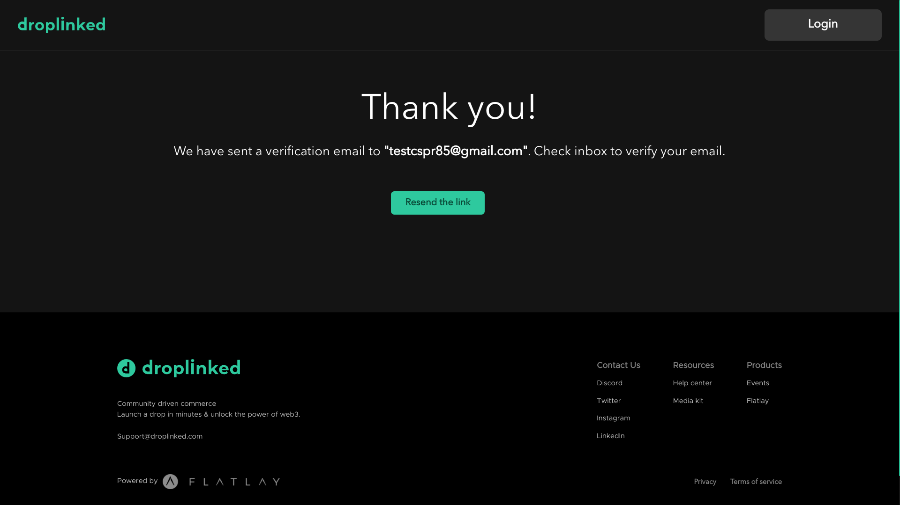
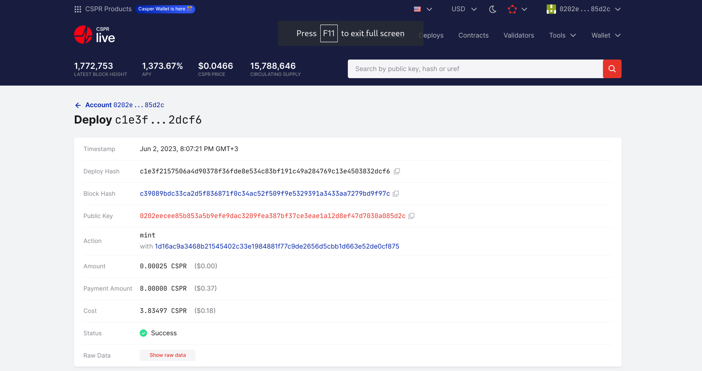

Grant Proposal | [718 - Casper Shops](https://portal.devxdao.com/public-proposals/718)
------------ | -------------
Milestone | 4
Milestone Title |  Payment Integration with CSPR token (100 hours)
OP | droplinked
Reviewer | Mehmet Sait Gülmez <cenggulmez.65@gmail.com>

# Milestone Details

## Details & Acceptance Criteria

**Details of what will be delivered in milestone:**

Payment system integration via Stripe with CSPR settlement

**Acceptance criteria:**

Live integration with CasperPunks Shop

**Additional notes regarding submission from OP:**

Here you can review checkout with CSPR payment on products using the Casper Wallet: https://casper.droplinked.com Repo for Casper Shop: https://github.com/FLATLAY/droplinked_casper

## Milestone Submission

The following milestone assets/artifacts were submitted for review:

Repository | Revision Reviewed
------------ | -------------
https://github.com/FLATLAY/droplinked_casper | 01b7ef8


# Install & Usage Testing Procedure and Findings

The reviewer used Fedora Linux 35 for review of this project and followed instructions given on README. After reviewing the project, the reviewer observed that documentation needed some improvements, ```About``` section in github repository was empty, Deploy example on README file didn't work and negative test cases were not available. There were 5 integration tests. The reviewer's first attemp to build the project by following the instructions given on the README resulted in [failure](assets/fail-to-build-logs.md). However, it was successfully built after the reviewer has done some research on this issue. It was solved by running ```rustup target add wasm32-unknown-unknown``` then ```make build-contract``` commands in succession. The reviewer contacted to the OP to discuss on the issues mentioned above. OP immediately started to work on these issues. OP improved the project documentation, updated deploy command given on README, added description on github ```About``` section and also added more test cases both positive and negative test cases. 


## Overall Impression of usage testing

- [Build logs](assets/backend-build.md)

Example of sending WASM file to casper node and deploy it on the chain.

```bash
ndpc_contract (main)$ casper-client put-deploy -n http://89.58.52.245:7777 \
--chain-name casper-test --payment-amount 231420060000 \
-k keys/m.pem --session-path deploy/contract.wasm \
--session-arg "ratio_verifier:string='0144f5adf499591351807bc83490314262bd6846beee80a16269a83c9901ecec8a'" \
--session-arg "fee:u64='100'" \
--ttl "5hour"
{
  "id": 6348862178308581047,
  "jsonrpc": "2.0",
  "result": {
    "api_version": "1.4.15",
    "deploy_hash": "397b1cb7941f75e34a898e89caceac3fc6f51b4b1b9d7e353fc9ec948c44416e"
  }
}
```

Deploy the contract: https://testnet.cspr.live/deploy/397b1cb7941f75e34a898e89caceac3fc6f51b4b1b9d7e353fc9ec948c44416e

## Usage Testing

## 1. Process of Testing a Contract
Three accounts are needed to test the contract, Account names can be `producer`, `publisher` and `customer` respectively.
These accounts should be created on `Casper Wallet` and faucet them on TestNet.

Unlock the casper wallet


Select the `settings` section and then click on the `Create Account` button there


Give a name to your account and click on the `Create Account`


You should do this for all the 3 mentioned accounts. Then you'll need to faucet your accounts on testnet, Select your account on your wallet and hit `Manage Account`


Click `View on CSPR.live`


When you are on casper testnet, click on the `Connect` button on your account


Click the `faucet` button


Fill in the captcha, and Click on the `Request tokens` button, It would take up to 2 minutes to give you 2000 CSPRs. Do as so for other 2 accounts, So at the end you would have 3 accounts with 2000 CSPRs in each of them.


___
### 2. Create an Account on droplinked & Record Your Product

Move to https://ngsf.flatlay.io/, Enter your username and hit the `Sign up` button


Fill the requested information and click on the `Sign up` button


You have to verify the link sent to your email



Click on the `Login` button and fill in your data


Fill in requested data


** In the address part, make sure you enter a valid address 


Click `Save` button, And fill the store design part as you desire, Then in the payment options page, choose the IMS type to droplinked


Activate the casper payment and paste the publickey of the `producer` here and hit Next.


Fill in the contact page as you desire and hit the Publish Store button
You would be transferred to the Products page of droplinked.


Hit the `New Product` Button to create a new product. Fill in the needed information as I do 


Add variants to your prodcut and hit save on each of them


Click on the `Publish` button to create your product.


From the above page, select `edit` product (on the right hand of the product)


Open up your wallet, move to `Producer` account, and hit `Connect` button to connect to `droplinked`, And then in the product variants section, click on the green icon (Record product)


Choose the BlockchainNetwork to casper, and enter a comisson (between 1 and 100) and hit the `Drop` button 


Your wallet would be opened and ask you to sign a text, click on `Sign`


A popup window would open to you which shows you the deploy hash and the link to testnet, click on it, you would go to the deployment page on testnet, and after a minute or two, the deploy would execute succssfully


The deploy hash that was shown in this example was:
https://testnet.cspr.live/deploy/c1e3f2157506a4d90378f36fde8e534c83bf191c49a284769c13e4503832dcf6



The reviewer was able to deploy the contract successfully by following instructions that the OP provided. Moreover, The reviewer can say that usage testing has been clearly defined. The OP has done an amazing job. Users of this project can easily deploy a contract if they follow the instructions step by step.

The reviewer strongly recommended that users of this project may refer to [Usage Testing in Details](https://github.com/FLATLAY/droplinked_casper/blob/main/usageTesting.md) which has done by the OP.

Documentation provides clear and sufficient instructions for build and installation.

Requirement | Finding
------------ | -------------
Project builds without errors | PASS 
Documentation provides sufficient installation/execution instructions | PASS 
Project functionality meets/exceeds acceptance criteria and operates without error | PASS 

# Unit / Automated Testing

The project has 16 test cases which including both unit and integration tests. The reviewer observed that all of the tests successfully pass.

- [Unit and integration tests logs](assets/backend-tests.md)

Requirement | Finding
------------ | -------------
Unit Tests - At least one positive path test | PASS 
Unit Tests - At least one negative path test | PASS 
Unit Tests - Additional path tests | PASS 

# Documentation

### Code Documentation

The reviewer has observed that the project documentation is an acceptable level.

Requirement | Finding
------------ | -------------
Code Documented | PASS 

### Project Documentation

The project documentation is sufficient. However, it will be more clear and concise for the users of this project, if the OP provides a better example.

Requirement | Finding
------------ | -------------
Usage Documented | PASS 
Example Documented | PASS with Notes

## Overall Conclusion on Documentation

In the reviewer's opinion, documentation should be improved. The code-level documentation is sufficient.

# Open Source Practices

## Licenses

On the grant, It is stated that License will be Creative commons (for research and documents only) for this project. However, the reviewer observed that OP added MIT license to the repository.

Requirement | Finding
------------ | -------------
OSI-approved open source software license | PASS with Notes

## Contribution Policies

The project contains a CONTRIBUTING and SECURITY policy that links to a Code of Conduct policy. Pull requests and Issues are enabled.

Requirement | Finding
------------ | -------------
OSS contribution best practices | PASS 

# Coding Standards

## General Observations

Code is generally well-structured and readable. The project has been committed to GitHub and all 16 tests passed.

# Final Conclusion

The project builds successfully and passes all tests. The documentation is sufficient. Source code is well written and reviewer observed that standard comments were applied properly on the critical functions. This enables code-level documentation. However, the project documentation needs to be improved.

In the reviewer opinion, this submission should pass with notes.

# Recommendation

Recommendation | PASS with Notes
------------ | -------------