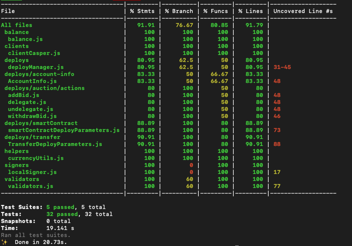

Grant Proposal | [72 - CasperHolders Interact with the Casper Network](https://portal.devxdao.com/public-proposals/72)
------------ | -------------
Milestone | 2
Milestone Title | Implement Validators / Smart Contracts operations
OP | Killian
Reviewer | Michael Steuer <michael@make.software>

# Milestone Details

## Details & Acceptance Criteria

**Details of what will be delivered in milestone:**

- Validators will be able to Add Bid / Withdraw bid from theirs nodes.
- Users will be able to send smart contract to the blockchain

**Acceptance criteria:**

- A validator can add or withdraw a bid.
- Users can send a smart contract on the blockchain.

## Milestone Submission

The following milestone assets/artifacts were submitted for review:

Repository | Revision Reviewed
------------ | -------------
https://github.com/casperholders/casperholdersfront | c60a380
https://github.com/casperholders/casperholdersapi | 671a6c3
https://github.com/casperholders/casperholderscore | a6ba732

## Milestone Notes
It should be noted that this is a Second Milestone for this project, and that the [First Milestone](../1%20-%20Release%20the%20code%20to%20GitHub%20and%20deploy%20the%20website/README.md)
originally "Passed with Notes", with a request to the OP to address all the issues raised in the original review before
submitting a next milestone. The OP took this to heart and addressed all open issues, and submitted a [Pull Request](https://github.com/CodeReviewDAO/dxd_codereview/pull/4) with a
Fix Log, which has not become part of the record of this project's review [here](../1%20-%20Release%20the%20code%20to%20GitHub%20and%20deploy%20the%20website/FIXES.md).
This Reviewer, having reviewed the fixes, asserts that the request to address the identified issues has been fully 
complied with.

# Install & Usage Testing Procedure and Findings

Following the instructions in the README of https://github.com/casperholders/casperholdersfront, https://github.com/casperholders/casperholderscore 
and https://github.com/casperholders/casperholdersapi, reviewer was able to successfully build and run each project.
No errors were produced during compilation, and the CasperHolders site became available
at http://localhost:8081/. 

At first attempt while smoke-testing the site and trying the on-chain functionality, a CORS issue was uncovered that could
easily be addressed by pointing the project to a RPC node proxy that allowed access from `localhost`.

Subsequently, all functionality worked flawlessly, including the functionality that comprises the **Acceptance Critera**, specifically
being able to "Add Bid", "Withdraw Bid" and "Submit a Contract". No errors were encountered, and Reviewer was able to complete those operations
successfully:

- Add Bid Operation: https://testnet.cspr.live/deploy/21f623b5cd86eaa2759d783ea85181bd16c9764c562efe25ab3d3e87171d1fc1
- Withdraw Bid Operation: https://testnet.cspr.live/deploy/0b5628ad1da044d76f7e462c8d641719fd0c64e3865ae1ece6da147c900e6813
- Contract Deployment: https://testnet.cspr.live/deploy/315fb9631df003903f97e0e3e04718e157fbe203d8ced0aa59f37acfe5b1842a (MissingArgument error unrelated to CasperHolders functionality.)

Requirement | Finding
------------ | -------------
Project builds and runs without errors | PASS
Documentation provides sufficient installation/execution instructions | PASS
Project functionality meets/exceeds acceptance criteria and operates without error | PASS
API Endpoints work without error | PASS

# Unit / Automated Testing

The projects included ample unit testing with an impressive amount of code coverage, and positive as well as negative 
path tests.

Requirement | Finding
------------ | -------------
Unit Tests - At least one positive path test | PASS
Unit Tests - At least one negative path test | PASS
Unit Tests - Additional path tests | PASS

# Documentation

Considering the deliverable contains multiple project repositories, each will be evaluated separately below

## CasperHoldersAPI

### Code Documentation

The code in the API project is well documented

Requirement | Finding
------------ | -------------
Low level function documentation | PASS

### Project Documentation

The README.md file provides sufficient documentation on how to install and run the project, build a docker image
and deploy with Kubernetes

Requirement | Finding
------------ | -------------
Sufficient Project Documentation | PASS

### API Documentation

As an API project, API end point documentation is required. This project contains sufficient API documentation and provides
a Swagger UI to review and test out API end points

Requirement | Finding
------------ | -------------
API documentation | PASS

## CasperHoldersFront

### Code Documentation

The code in the Front End project is well documented.

Requirement | Finding
------------ | -------------
Low level function documentation | Pass

### Project Documentation

The README.md file provides sufficient documentation on how to install and run the project, build a docker image
and deploy with Kubernetes.

Requirement | Finding
------------ | -------------
Sufficient Project Documentation | PASS

### API Documentation

N/A

Requirement | Finding
------------ | -------------
API documentation | N/A

## CasperHoldersCore

### Code Documentation

The code in this project, which as a core library provides much of the API for the CasperHoldersFront project, is well
documented and each function has a clear description of its use, parameters and output.

Requirement | Finding
------------ | -------------
Low level function documentation | PASS

### Project Documentation

The README.md file provides documentation on how to install and build the project, install the library into another project, and presents a link
to documentation of the core library. The OP also provides a build step to generate `docs` for the project, which results in a
robust API documentation package.

Requirement | Finding
------------ | -------------
Sufficient Project Documentation | PASS

### API Documentation

As the Core API library of the project, this sub-project should have detailed API documentation. The API provides very detailed
API documentation. The OP also provides a build step to generate `docs` for the project, which results in a
robust API documentation package.

Requirement | Finding
------------ | -------------
API documentation | PASS

## Overall Conclusion on Documentation

The OP has done a fantastic job improving the documentation for this project since [Milestone 1 Review](../1%20-%20Release%20the%20code%20to%20GitHub%20and%20deploy%20the%20website/README.md)

# Open Source Practices

## Licenses

Each of the projects is released under the Apache 2.0 License

Requirement | Finding
------------ | -------------
OSI-approved open source software license | PASS

## Contribution Policies

Each of the projects has CONTRIBUTING policy as well as a CODE OF CONDUCT for contributors. Issues and Pull Requests are enabled
for each project.

Requirement | Finding
------------ | -------------
OSS contribution best practices | PASS

# Coding Standards

## General Observations

Code is clean and readable, and the project is easy to understand and to use.

# Final Conclusion

OP has done a great job taking the feedback of Milestone 1 Review into account and submitted a Milestone that meets or exceeds
all the standards required by the DEVxDAO.

# Recommendation

Recommendation | PASS
------------ | -------------

