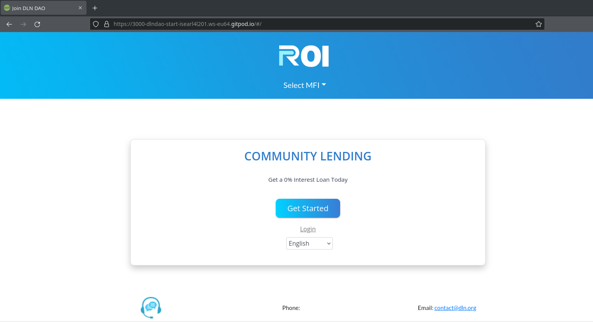
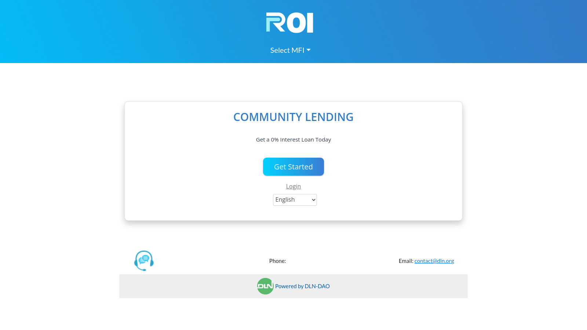
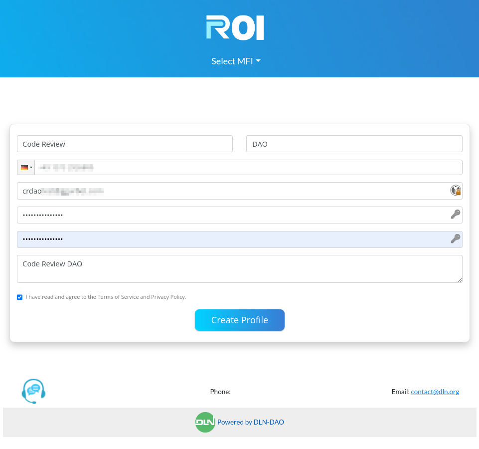
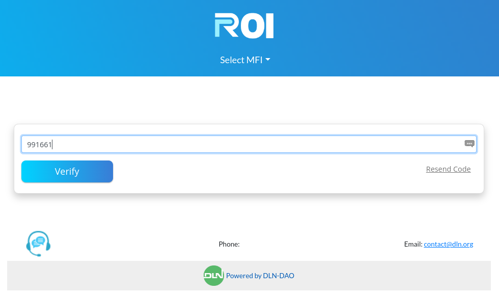
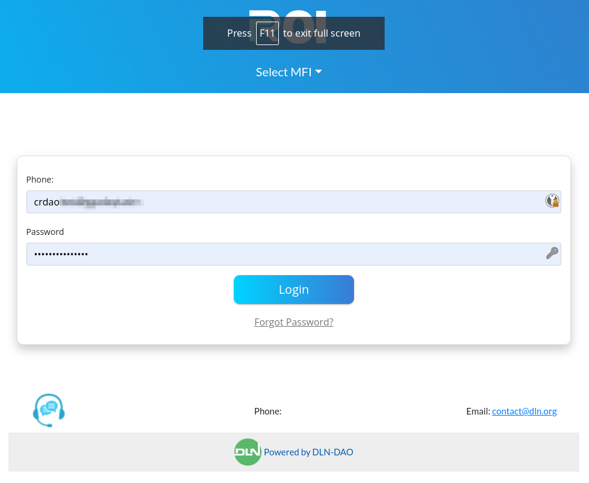
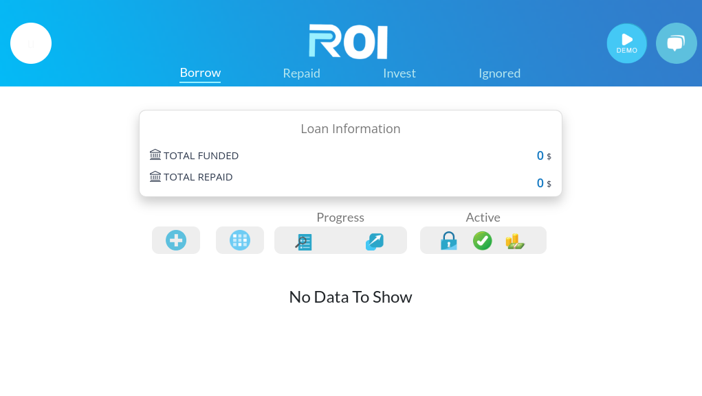
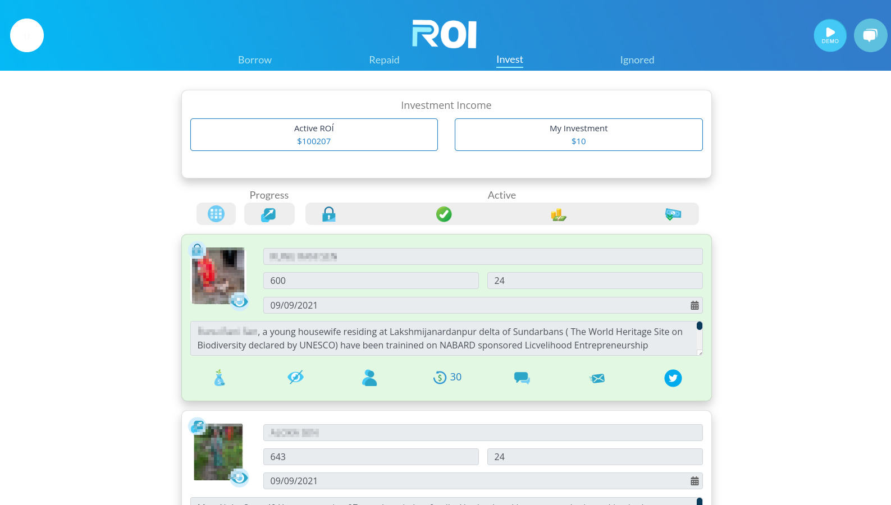

Grant Proposal | [74 - Developing DLN Social Smart Contract and DeFi Treasury Investment Policy](https://portal.devxdao.com/public-proposals/74)
------------ | -------------
Milestone | 5
Milestone Title | General Rollout
OP | Dr. Adel
Reviewer | Gökhan Gurbetoğlu <crdao@ggurbet.com>

# Milestone Details

## Details & Acceptance Criteria

**Details of what will be delivered in milestone:**

- Full scale upgrade including frontend and backend upgrade to ensure speed
- Fully executed agreements with local providers to ensure legal compliance
- Documented final APIs including how to integrate with the system
- Regional hub traffic routing to ensure full adoption of the global infrastructure

**Acceptance criteria:**

Successful Launch to the MainNet

**Additional notes regarding submission from OP:**

As per the acceptance criteria:  
"Successful Launch to the MainNet"

The contract has been deployed to the main net, with the following TX: https://cspr.live/deploy/50b47e2d550790b6239dbdd2c741137ec9647898623e20a216f00a3ec88850a6

The Main Net UI is being updated to: https://start.dln.org/  
While the test net UI is at: https://start.dlndao.org/

Notes:
- Full audit has not been executed, expecting to get help for it.
- The implemented version of staking is outdated, we plan to take advantage of grant 589: https://portal.devxdao.com/app/proposal/589
- We intend to take advantage of DAO examples that can reduce the running cost of the project
- We plan to ask for a grant to integrate with grant 532

## Milestone Submission

The following milestone assets/artifacts were submitted for review:

Repository | Revision Reviewed
------------ | -------------
https://github.com/dlndao/start | 4553d89

# Install & Usage Testing Procedure and Findings

The contract has been deployed to the main net, with the following TX:
https://cspr.live/deploy/50b47e2d550790b6239dbdd2c741137ec9647898623e20a216f00a3ec88850a6

- [Deployment log](assets/deploy.md)

Local installation was done on an Ubuntu 20.04 LTS Gitpod cloud machine. The project built successfully without errors.

Further usage testing was done on Testnet at https://start.dlndao.org/.

After entering the website, reviewer created an account and logged in.

Other parts of the system also work as intended. Some additional screenshots of the interface are as follows:

## Overall Impression of usage testing

Project builds and runs without errors. There needs to be some performance improvements needed to be made. Reviewer suggests adding pagination into investments page since the page tries to load all investments at once causing performance issues. Not included in the acceptance criteria, but could be useful, is an addition of search functionality.

Requirement | Finding
------------ | -------------
Project builds without errors | PASS
Documentation provides sufficient installation/execution instructions | PASS
Project functionality meets/exceeds acceptance criteria and operates without error | PASS with Notes

# Unit / Automated Testing

All automated unit tests PASS for this milestone. Tests cover critical functionality. Reviewer successfully ran all automated tests on an Pardus 21.3 machine. Overall quality of tests are sufficient. Test output is below.

- [Unit tests output](assets/unit-tests.md)

Requirement | Finding
------------ | -------------
Unit Tests - At least one positive path test | PASS
Unit Tests - At least one negative path test | PASS
Unit Tests - Additional path tests | PASS

# Documentation

### Code Documentation

Code documentation covers critical functionality. Almost all files have explanatory comments. There are some typos and grammatical errors in the comments though.

Requirement | Finding
------------ | -------------
Code Documented | PASS with Notes

### Project Documentation

Project documentation is sufficient. Proper installation, testing and deployment requirements are stated in the README file. Additional documentation is generated and readily available for developers.

Requirement | Finding
------------ | -------------
Usage Documented | PASS
Example Documented | PASS

## Overall Conclusion on Documentation

Documentation is sufficient and well prepared. Small stylistic and syntactic improvements in future updates could be beneficial for the project.  
Extra documentation is readily available at `/docs` folder.

# Open Source Practices

## Licenses

The project is released under MIT license.

Requirement | Finding
------------ | -------------
OSI-approved open source software license | PASS

## Contribution Policies

The project contains a CONTRIBUTING and SECURITY policy. Pull requests and Issues are enabled.

Requirement | Finding
------------ | -------------
OSS contribution best practices | PASS

# Coding Standards

## General Observations

Source code is well-written and thought out. It is easily readable. General best coding practices are used throughout the project.

# Final Conclusion

The milestone meets its acceptance criteria. Small performance improvements in the future of the project is expected and also suggested by the reviewer. All other aspects of the project is sufficiently provided for this review. The reviewer suggests the project to PASS with Notes.

# Recommendation

Recommendation | PASS with Notes
------------ | -------------