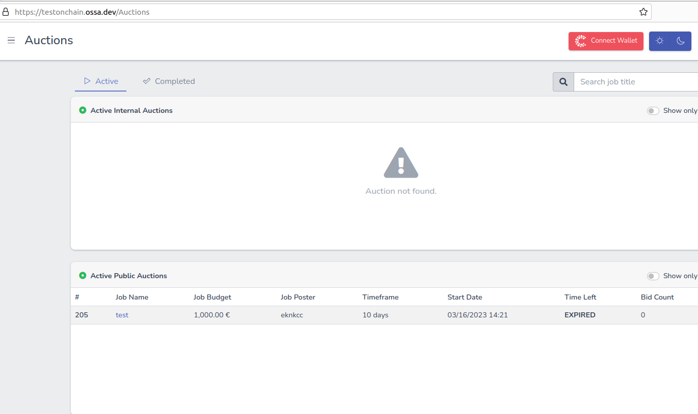
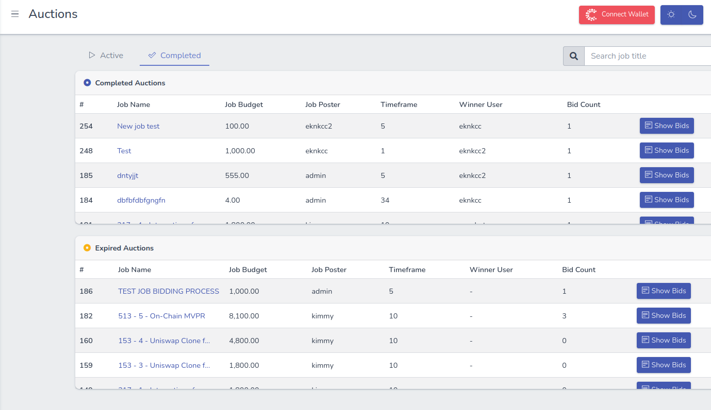
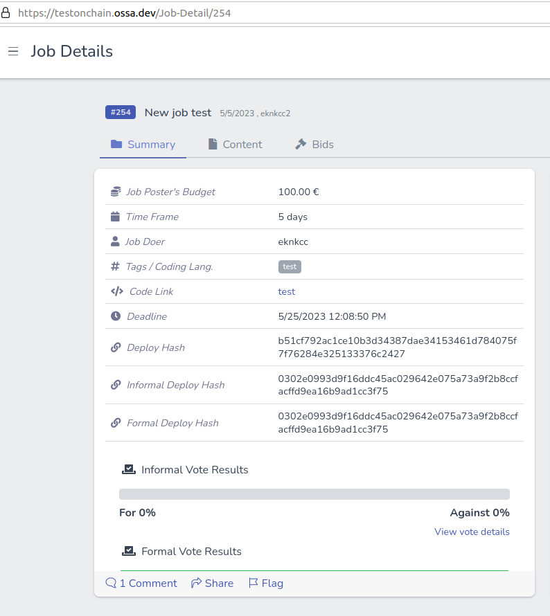
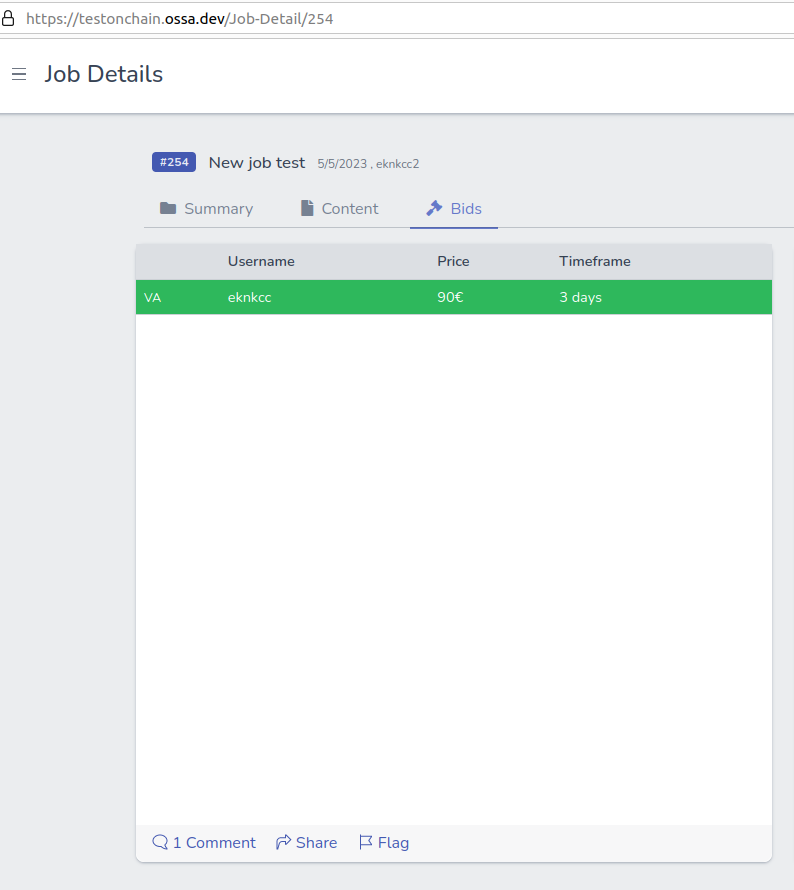

Grant Proposal | [801 - DxD Onchain Transition – Bid Escrow contract integration](https://portal.devxdao.com/public-proposals/801)
------------ | -------------
Milestone | 1
Milestone Title | Development & Deployment
OP | eknkcc
Reviewers | Furkan Ahmet Kara <furkanahmetkara.fk@gmail.com>

# Milestone Details

## Details & Acceptance Criteria

**Details of what will be delivered in milestone:**

• Listing Internal / Public auctions onchain data
    • Listing Bids from onchain data
    • Bidding on auction using Bid Escrow contract
    • Internal worker flow backend development
    • External worker flow backend development
    • UI / UX changes required for onchain features

**Acceptance criteria:**

• All users should be able to see ongoing and completed auctions in the "Auctions" page

• All users should be able to see bids of completed auctions in the "Auction Detail" page

• VAs and external users should be able to bid with their CSPR wallet.

• After an internal auction and job completion user's should be able to see details in the portal. (Job Detail)

• After an external auction and job completion user's should be able to see details in the portal. (Job Detail)

• Users should be able to see deploy hashes, chain requests and user public keys in the UI

**Additional notes regarding submission from OP:**

Only UI functionality should be reviewed. Backend functionalities and smart contracts will be reviewed separatly.

## Milestone Submission

The following milestone assets/artifacts were submitted for review:

Repository | Revision Reviewed
------------ | -------------
https://github.com/odradev/odra | aa6351c

# Install & Usage Testing Procedure and Findings

Following the instructions in the [README](https://github.com/furkanahmetk/crdao-frontend) of the project, reviewer was able to successfully install the project along with it's dependencies, and run for this milestone on Ubuntu 20.04. İnstructions can be improved but sufficient enough, it can be better to have more explanation about them in the README of the project. Also, adding a requirement.txt and using it to install prerequisities might be useful too. Project builds without errors but with warnings.

[Build Logs](assets/dotnetbuild.md)

## Overall Impression of usage testing

The project builds without errors, the documentation provides sufficient installation and execution instructions. Build instructions are giving required information but can be enhanced and more clear by detailing each step. Same as installation instrutctions this part also needs improvements in the reviewer's opinion . The project functionality meets/exceeds the acceptance criteria and operates without errors. Functionalities mentioned in the acceptance criteria works well and screenshots can be found below.

Requirement | Finding
------------ | -------------
Project builds without errors | PASS
Documentation provides sufficient installation/execution instructions | PASS with Notes
Project functionality meets/exceeds acceptance criteria and operates without error | PASS

# Unit / Automated Testing

The project has sufficient amount of tests, covering both positive and negative paths. All tests run successfully. Testing instructions are missing and should be added.

[Test Logs](assets/dotnettest.md)

Requirement | Finding
------------ | -------------
Unit Tests - At least one positive path test | PASS with Notes
Unit Tests - At least one negative path test | PASS with Notes 
Unit Tests - Additional path tests | PASS with Notes

# Documentation

### Code Documentation

The critical functions of the project have an acceptable level of code-level documentation.

Requirement | Finding
------------ | -------------
Code Documented | PASS

### Project Documentation

The project has sufficient documentation coverage for usage but can be improved with visuals, along with the installation, build instructions. Testing instructions should be added.

Requirement | Finding
------------ | -------------
Usage Documented | PASS with Notes
Example Documented | PASS with Notes

## Overall Conclusion on Documentation

In the reviewer's opinion, this review should PASS with Notes

# Open Source Practices

## Licenses

The Project is released under the MIT License.

Requirement | Finding
------------ | -------------
OSI-approved open source software license | PASS

## Contribution Policies

Pull requests and Issues are enabled on the repository, and the project contains a CONTRIBUTING and a SECURITY policy. CODE OF CONDUCT can be added.

Requirement | Finding
------------ | -------------
OSS contribution best practices | PASS

# Coding Standards

## General Observations

The project published publicly on GitHub. Project documentation is sufficient enough as general. Test coverage is good enough but can be improved, and all test run successfully but missing testing instructions.

All functions mentioned in the acceptance criteria implemented and work properly.

# Final Conclusion

The project meets the milestone acceptance criteria. Install and usage instructions are sufficient  Tests run successfully.

Thus, in the reviewer's opinion, this submission should PASS with Notes.

# Recommendation

Recommendation | PASS with Notes
------------ | -------------
