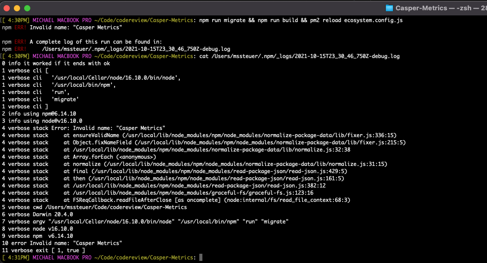
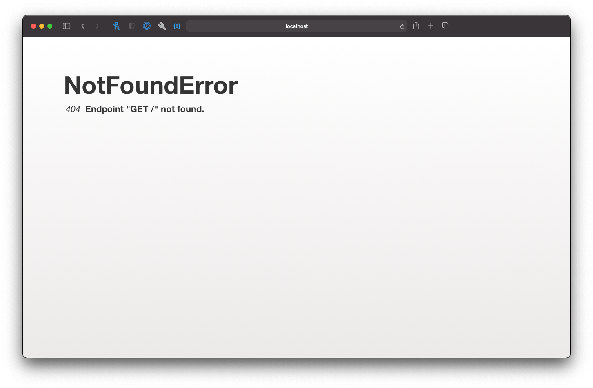
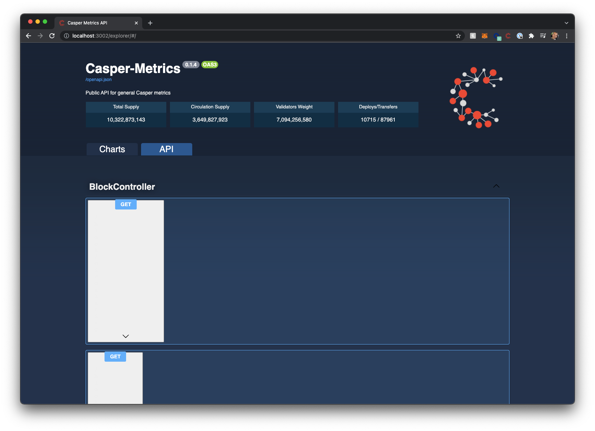
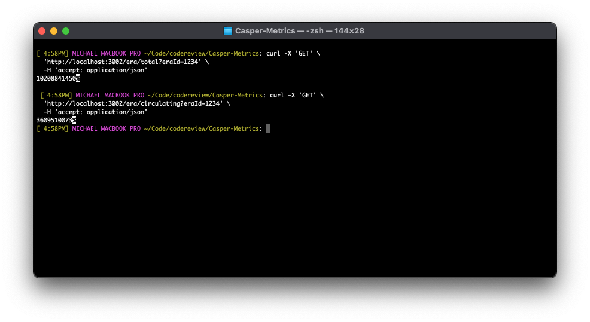

# Second Review

Grant Proposal | [86 - CSPR Metrics API and Historical Archive for Services, Daps and Analytics](https://portal.devxdao.com/public-proposals/86)
------------ | -------------
Milestone | 1
Date | 10/15/2021

## Introduction
In response to the FAIL conditions in the original [Code Review](README.md) for this milestone, OP has requested a
Second Review of their milestone, after asserting that the FAIL conditions have been addressed in their milestone.

The following milestone assets/artifacts were submitted for second review:

Repository | Revision Reviewed
------------ | -------------
https://github.com/a3mc/Casper-Metrics | 0ea9c15820b20308678453f8b6e2bf03c3bbf090
Comparison | https://github.com/a3mc/Casper-Metrics/compare/e9b76f4178ab792d30bbfbc7a8db8f7bcbd35ada...0ea9c15820b20308678453f8b6e2bf03c3bbf090
Comparison Stats |  7 changed files with 192 additions and 34 deletions.

Reviewer is focusing this review solely on verifying that the FAIL conditions have been addressed.

## FAIL CONDITIONS 1 & 2

_ | FAILED Condition
------------ | -------------
1 | Project functionality meets/exceeds acceptance criteria and operates without error
2 | API Endpoints work without error

Both failed conditions are evaluated together in this second review, as they were closely tied. 

First, Reviewer updated the project and ran `npm install` to update any dependencies. Then, Reviewer ran `npm run migrate && npm run build && pm2 reload ecosystem.config.js`
in order to test the project. The first result was the following:


Reviewer deduced based on the error stack that the problem must lie in `package.json`, edited the file to replace "Casper Metrics" with "Casper-Metrics" and tried again.

> Package name is not compliant with the [Pacakge.json requirements](https://docs.npmjs.com/cli/v7/configuring-npm/package-json) by containing
> a non-URL-safe character in the value. OP should address this before the next milestone submission.

This time the application would build and run successfully. OP has now included additional documentation pointing out
the URLs to access the application. While the Dev Admin loaded correctly on http://localhost:3003, when trying to access the
Dev Portal on http://localhost:3002 a `404 error` was encountered:



As it turns out, the actual URL to the Dev Portal is http://localhost:3002/explorer/, from where the UI became accessible.

> OP should update the documentation to properly indicate how to access the application, before submitting the next milestone.

While the dashboard loaded and the Charts section displayed fine, the API UI was still not displaying properly, much like during
the first review of this milestone:



> OP should address the UI defects in the application before submitting the next milestone

In the original [Review](README.md), the following 2 API calls failed:

```bash
curl -X 'GET' \
  'http://localhost:3002/era/circulating?eraId=1234' \
  -H 'accept: application/json'
```

```bash
curl -X 'GET' \
  'http://localhost:3002/era/total?eraId=1234' \
  -H 'accept: application/json'
```

Reviewer tested the new submission to see if these API endpoints were fixed and now return data as expected. Reviewer
is happy to report that both endpoints now return appropriate responses with data that appears accurate.



Reviewer subsequently tested all other API endpoints to ensure no regression had occurred and confirms the entire API works
properly.

### Second Review Results of FAIL Conditions 1 & 2

Requirement | Original Finding | New Finding
------------ | ------------- | -------------
Project functionality meets/exceeds acceptance criteria and operates without error | FAIL | PASS with notes (requires fixing before next milestone)
Documentation provides sufficient installation/execution instructions | FAIL | PASS

### Second Review  of FAIL Conditions around Unit Testing

In the [First Review](README.md), the following were the results of testing the project's unit testing:

Requirement | Finding
------------ | -------------
Unit Tests - At least one positive path test | PASS with notes (not all tests passed)
Unit Tests - At least one negative path test | FAIL
Unit Tests - Additional path tests | PASS

Reviewer went ahead and reviewed the unit tests to verify if the above FAILs and notes were addressed in the resubmission and found the following:

```bash
[ 5:03PM] MICHAEL MACBOOK PRO ~/Code/codereview/Casper-Metrics: npm run test    

> Casper-Metrics@0.1.4 pretest /Users/mssteuer/Code/codereview/Casper-Metrics
> npm run rebuild


> Casper-Metrics@0.1.4 rebuild /Users/mssteuer/Code/codereview/Casper-Metrics
> npm run clean && npm run build


> Casper-Metrics@0.1.4 clean /Users/mssteuer/Code/codereview/Casper-Metrics
> lb-clean dist *.tsbuildinfo .eslintcache


> Casper-Metrics@0.1.4 build /Users/mssteuer/Code/codereview/Casper-Metrics
> lb-tsc && cp dist/environments/mainnet-dev.environment.js dist/environments/environment.js


> Casper-Metrics@0.1.4 test /Users/mssteuer/Code/codereview/Casper-Metrics
> lb-mocha --allow-console-logs "dist/__tests__"


  BlockController
@jsonMember on e.args: property is a Map. Use the jsonMapMember decorator to serialize this property.
info: Service init. {"timestamp":"2021-10-16T00:04:15.197Z"}
    1) invokes GET block/circulating
    ✔ invokes GET block/circulating with block id (73ms)
    ✔ should return 404 on non-existing block when querying circulating
    ✔ invokes GET block/total
    ✔ invokes GET block/total with block height
    ✔ should return 404 on non-existing block when querying total
    2) invokes GET block without params - last
    ✔ invokes GET block with block height
    ✔ should return 404 when querying non-existing block

  EraController
info: Service init. {"timestamp":"2021-10-16T00:04:15.469Z"}
    ✔ invokes GET era/circulating
    ✔ invokes GET era/circulating with era id
    ✔ should return 404 on non-existing era when querying circulating
    ✔ invokes GET era/total
    ✔ invokes GET era/total with era id
    ✔ should return 404 on non-existing era when querying total
    ✔ invokes GET era
    ✔ invokes GET era with era id
    ✔ should return empty array on non-existing era id when querying era objects
    ✔ invokes GET era by block height
    ✔ should return empty array on non-existing block height
    ✔ should accept correct timestamp
    ✔ should not accept incorrect timestamp
    ✔ should return last 5 eras, sorted by id desc
    ✔ should return first 3 eras, sorted by id asc

  HomePage
info: Service init. {"timestamp":"2021-10-16T00:04:15.668Z"}
    ✔ exposes explorer page
    ✔ have swagger css files
    ✔ have swagger js files


  25 passing (1s)
  2 failing

  1) BlockController
       invokes GET block/circulating:
     Error: expected 200 "OK", got 404 "Not Found"
      at Context.<anonymous> (src/__tests__/acceptance/block.controller.acceptance.ts:18:62)
      at processImmediate (node:internal/timers:464:21)
  ----
      at Test._assertStatus (node_modules/supertest/lib/test.js:304:12)
      at /Users/mssteuer/Code/codereview/Casper-Metrics/node_modules/supertest/lib/test.js:80:15
      at Test._assertFunction (node_modules/supertest/lib/test.js:338:11)
      at Test.assert (node_modules/supertest/lib/test.js:209:21)
      at localAssert (node_modules/supertest/lib/test.js:167:12)
      at fn (node_modules/supertest/lib/test.js:164:5)
      at Test.callback (node_modules/superagent/src/node/index.js:902:3)
      at fn (node_modules/superagent/src/node/index.js:1130:18)
      at IncomingMessage.<anonymous> (node_modules/superagent/src/node/parsers/json.js:19:7)
      at IncomingMessage.emit (node:events:402:35)
      at endReadableNT (node:internal/streams/readable:1343:12)
      at processTicksAndRejections (node:internal/process/task_queues:83:21)

  2) BlockController
       invokes GET block without params - last:
     Error: expected 200 "OK", got 404 "Not Found"
      at Context.<anonymous> (src/__tests__/acceptance/block.controller.acceptance.ts:45:50)
      at processImmediate (node:internal/timers:464:21)
  ----
      at Test._assertStatus (node_modules/supertest/lib/test.js:304:12)
      at /Users/mssteuer/Code/codereview/Casper-Metrics/node_modules/supertest/lib/test.js:80:15
      at Test._assertFunction (node_modules/supertest/lib/test.js:338:11)
      at Test.assert (node_modules/supertest/lib/test.js:209:21)
      at localAssert (node_modules/supertest/lib/test.js:167:12)
      at fn (node_modules/supertest/lib/test.js:164:5)
      at Test.callback (node_modules/superagent/src/node/index.js:902:3)
      at fn (node_modules/superagent/src/node/index.js:1130:18)
      at IncomingMessage.<anonymous> (node_modules/superagent/src/node/parsers/json.js:19:7)
      at IncomingMessage.emit (node:events:402:35)
      at endReadableNT (node:internal/streams/readable:1343:12)
      at processTicksAndRejections (node:internal/process/task_queues:83:21)

```

Reviewer notes that 2 tests still fail, and that they fail because a `404 error` is returned from the `BlockController` when
no `blockHeight` parameter is passed in, whereas the tests expect a `200` result. Reviewer then verified in the API that indeed
a `404` is returned when no `blockHeight` is passed. Whether or not this is correct is beyond the Reviewer's purview, as it is
an application design question whether or not the application should perhaps return a `200` result with the latest block, or a `404`
result, when no specific `blockHeight` is passed. That being said, it is clear that the assertions in the unit-tests have 
not been properly implemented and that still not all tests pass.

> Before the next milestone submission, OP should ensure that all unit tests pass.

### Second Review Results of FAIL Conditions around Unit Testing

Reviewer was able to confirm that the OP has now included negative path unit tests, and consequently the outcome
of the re-review is:

Requirement | Original Finding | New Finding
------------ | ------------- | -------------
Unit Tests - At least one positive path test | PASS with notes | PASS with notes (not all tests passed)
Unit Tests - At least one negative path test | FAIL | PASS
Unit Tests - Additional path tests | PASS | PASS

# Recommendation

Given that OP has mediated all FAIL conditions from the first review, it is this Reviewer's recommendation to "PASS with notes" this code
review. Since several "PASS with notes" conditions from the [First Review](README.md) have not been addressed, and more have been added with this re-submission, a clean "PASS" 
was not possible. Before submitting a next milestone, OP should address these notes so that the next milestone has a chance of cleanly passing.

That said, Reviewer wants to acknowledge that the documentation quality of the project has improved with this re-submission, and
that the unit testing, despite some tests still failing, has significantly increased in code coverage. Reviewer
appreciates OP's incorporation of his feedback into the resubmission. 

Recommendation | PASS with notes
------------ | -------------

