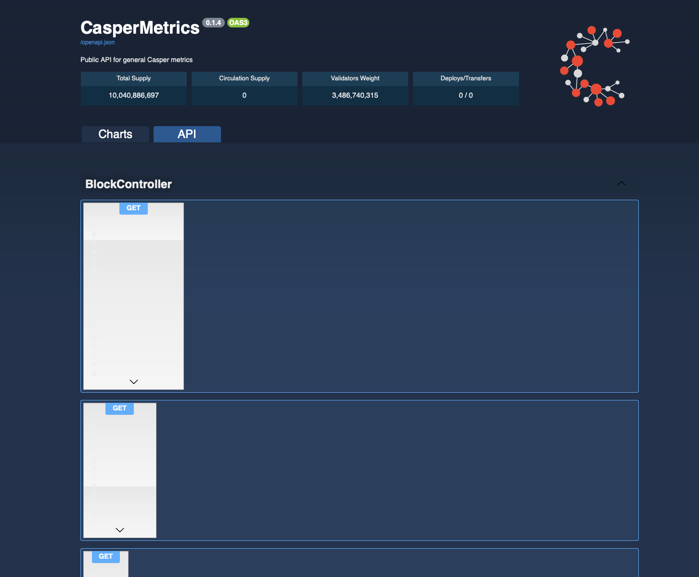

Grant Proposal | [86 - CSPR Metrics API and Historical Archive for Services, Daps and Analytics](https://portal.devxdao.com/public-proposals/86)
------------ | -------------
Milestone | 1
Milestone Title | Production ready prototype
OP | Daniel Halford
Reviewer | Michael Steuer <michael@make.software>

# Milestone Details

## Details & Acceptance Criteria

**Details of what will be delivered in milestone:**

Understanding the needs of the community, the first phase has been started ASAP, without waiting for grants or 
any formalities. The need for transparent and clear numbers of basic metrics and the ability to see the
historical picture is crucial. We developed a POC, that indexes the main metrics for each block and era,
providing the historical view and an easy way to access this data. It was built with an ability to adjust it easily,
if anything is missed. With its flexible architecture it’s possible to recalculate, validate or add new metrics without
shutting down the system. 

- Set up infrastructure, including a VPS, Loopback framework, Nginx, Swagger, MySQL, CloudFlare; 
- Create a crawler that parses blocks, extracts, calculates and stores general metrics for each block and era, 
  including: 
  - Circulation Supply 
  - Total Supply
  - Validators Weights 
  - Validators Rewards 
  - amount of staked and un-staked transactions
- Configure Swagger to display endpoints with general metrics; 
- Set up limit rating and dos protection; 
- Add ability to filter by block height, timestamp or era; 
- Test the stability of the app and its ability to recover; 
- Create graphs with basic metrics displaying the historical data for the last two weeks.

**Acceptance criteria:**

- Swagger web interface allows full exploration of data and all values can be checked and measured.
- Endpoints are ready to be consumed and provide correct metrics.
- At this point reasonable heavy rate limit been applied, since load and scalability is scheduled to the upcoming milestones.

**Additional notes regarding submission from OP:**

Acceptance criteria:

- Web interface representing metrics data;
- API endpoints to various set of data including blocks, eras, supply, stake, weights;
- Swagger API interface

After months of hard work and several revisions, the project meets all of the above requirements and delivers additional 
features that allows easy maintenance and project growth.

The following was implemented in the scope of this Milestone:

- Scalable infrastructure;
- Asynchronous Crawler, that constantly indexes new blocks and eras, but can be run from Genesis if new metrics needs to be adopted or in case of replication.
- Web interface with metrics and graphs, representing historical data, including Circulating Supply,
  transactions count, validators/delegators amount, rewards per each block and era.
- Interface for accessing API, allowing wide range of filtering by key parameters;

This milestone was already done a while ago, however, to deliver completed project with correct
lock/unlock state and taking in consideration DxD community requests and concerns, we had to focus on Milestone
2 and 3 in parallel (admin section, improvements and additional calculation methods), since we don't know if multiple 
milestones can be technically submitted, we like to mention 2 and 3 are good to go.

Working version can be observed at https://cspr.rpc.best

Login credentials for administration panel can be provided by request.

## Milestone Submission

The following milestone assets/artifacts were submitted for review:

Repository | Revision Reviewed
------------ | -------------
https://github.com/a3mc/Casper-Metrics | e9b76f4

# Install & Usage Testing Procedure and Findings

Following the instructions in the README of https://github.com/a3mc/Casper-Metrics, reviewer first ensured that all listed prerequisites were met
and then was able to successfully build and run that project. Upon starting the project per the instructions, the crawlers 
started running and the Reviewer was able to confirm that the database began populating with data from the blockchain.

> NOTE: An improvement for the documentation would be to include the need to manually create the 'metricsdev' DataBase on the MySQL
> Server. The initial migration fails if that database is not already present.
 
Subsequently, Reviewer wanted to review the Web App, but had to dig around in code to find the correct path to it.

> NOTE: An improvement for the documentation would be to explicitly link to the URLs to the web applications, ie. http://localhost:3002/explorer and http://localhost:3003

The Admin Panel was immediately functional and allowed the Reviewer to classify inbound and outbound transactions as belonging to circulating supply or not. Moreover it 
allowed to designate a portion of Genesis supply to unlock after 1 year rather than 90 days. In both cases, the business logic appears to be forcing rigid constructs 
on the concept of circulating supply (the definition of circulating supply is "baked into" the business logic, and differs from how CasperLabs and Casper Association define it) 
as well as the vesting schedules (the only options were either 90 days or 1 year, whereas other vesting schedules exist). 

> NOTE: The utility of the functionality is questioned by this Reviewer given the rigidity of the definitions of Circulating Supply and Vesting Schedules, and their divergence
> from the definitions used by the Casper ecosystem. Moreover, it is unlikely a willing and qualified user for the Admin panel will be found (the Association would be the only ones
> qualified, but have a different process and definition for circulating supply. It "provides a solution without a problem").

After the Admin panel, the Reviewer tried to access the regular front-end and found it to have no data to display on the Charts tab, and some graphical distortions on the API tab (see screenshot below)


It appears that the visual defects result from some misconfiguration of Swagger. Reviewer compared the included `swagger-ui.css` with the version on OP's environment at https://cspr.rpc.best/css/swagger.css and concluded 
the two files are identical. Reviewer did note 
that the application did complain about the missing source map in the browser's JS console. Reviewer's theory is that it may have to do with relative paths, where on OP's live environment
the app is rewritten to run at the `/` root of the domain, vs. on localhost it runs at `/explorer`. 

> NOTE: OP should investigate the Swagger CSS issues and provide a resolution with the next milestone submission.

Reviewer had to confer with the OP to figure out  data issues. As it turned out, the product cannot be used until the crawler processes finish retrieving the entire blockchain, and 
perform subsequent calculations on the data in order to complete the population of all tables in the MySQL database. OP provided several mechanisms by which Reviewer could monitor 
the progress of that process. Additionally, during data bootstrapping multiple errors were observed where the crawler processes caused `Too many connections` errors on the MySQL server.
Reviewer repeatedly increased the `max_connections` value on the server in order to prevent those errors, since the required number of connections was unknown to Reviewer. Reviewer also
performed sanity tests on the data in the database and shared with OP that during the data ingestion process, while it appeared the most recent Block on the blockchain had been stored
in the database, the total count of blocks stored was less than expected (ie. equal to the total number of blocks on the blockchain). This was likely caused by the
`Too many connection` errors during data bootstrap. Restarting the crawler processes eventually filled in the gaps.

> NOTE: OP should update the documentation of the project with:
> - information detailing the data bootstrap process indicating that the application cannot be used until a the bootstrap process has completed
> - information on how to monitor the progress of the data bootstrap, and how to establish that it has completed
> - instructions on how to monitor and restart if necessary, the crawler processes
> - configuration values for MySQL Server to ensure `Too many connections` errors do not occur. OP knows the maximum connections of each crawler process and how many processes
> are spawned, so can easily provide a safe value.

Once the data was fully loaded, Reviewer confrimed that the Dashboard correctly displayed a table with Total Supply, Circulating Supply, Validator Weight and Deploys/Transfers. 
Additionally, the charts on the Charts tab all correctly displayed.

Subsequently, Reviewer tested the API endpoints, using the API tab. The aforementioned graphical distortions were noted, but didn't prevent Reviewer
from testing each endpoint. The following API calls were made successfully:

```bash
curl -X 'GET' \
  'http://localhost:3002/block/circulating?blockHeight=202969' \
  -H 'accept: application/json'
```

```bash
curl -X 'GET' \
  'http://localhost:3002/block/total?blockHeight=202969' \
  -H 'accept: application/json'
```

```bash
curl -X 'GET' \
  'http://localhost:3002/block?blockHeight=202969' \
  -H 'accept: application/json'
```

```bash
curl -X 'GET' \
  'http://localhost:3002/era?id=1234' \
  -H 'accept: application/json'
```

Each of the above executed successfully and returned expected output.

The following 2 API end points did NOT execute as expected. 

```bash
curl -X 'GET' \
  'http://localhost:3002/era/circulating?eraId=1234' \
  -H 'accept: application/json'
```

```bash
curl -X 'GET' \
  'http://localhost:3002/era/total?eraId=1234' \
  -H 'accept: application/json'
```

Both resulted in a `404 Not Found` era, even though `eraId 1234` is clearly valid, and returns a valid response in the `/era` API endpoint. To ensure that this was
not user error on the part of Reviewer, the following additional tests were performed:
- Different eraIds were tried, all known to be valid eras and all returning valid information on the `/era` endpoint
- Tested the same endpoints on OP's production environment (e.g. `https://cspr.rpc.best/era/total?eraId=1234`) and noting the same result for the 2 affected end-points. On OP's 
production environment they also do NOT work as expected.
- Both end-points DID work when no `eraId` parameter was provided, indicating there is something wrong with the querying logic of the underlying application code.
  
> FAIL NOTE: Since not all the API endpoints work successfully, that requirement has failed review. 

## Overall Impression of usage testing

The application would benefit from Documentation improvements with regards to initial set-up, as outlined above. The Admin and Dashboard web-apps work 
mostly as expected, with the exception of the visual defects noted above. The APIs are not all functional.

Requirement | Finding
------------ | -------------
Project builds and runs without errors | PASS with notes
Documentation provides sufficient installation/execution instructions | PASS with notes
Project functionality meets/exceeds acceptance criteria and operates without error | FAIL
API Endpoints work without error | FAIL

# Unit / Automated Testing

Project contains 8 unit tests that can be executed from the console. Tests cover only positive test paths. Not all tests 
pass, unfortunately. Below is the output of running unit tests:

```bash
[10:59AM] MICHAEL MACBOOK PRO ~/Code/codereview/Casper-Metrics: npm run test:dev

> CasperMetrics@0.1.4 test:dev /Users/mssteuer/Code/codereview/Casper-Metrics
> lb-mocha --allow-console-logs dist/__tests__/**/*.js && npm run posttest


  BlockController
@jsonMember on e.args: property is a Map. Use the jsonMapMember decorator to serialize this property.
info: Service init. {"timestamp":"2021-09-03T18:01:31.689Z"}
    ✔ invokes GET block/circulating (60ms)
    ✔ invokes GET block/total
    1) invokes GET block

  EraController
info: Service init. {"timestamp":"2021-09-03T18:01:31.826Z"}
    ✔ invokes GET era/circulating
    ✔ invokes GET era/total
    ✔ invokes GET era

  HomePage
info: Service init. {"timestamp":"2021-09-03T18:01:31.870Z"}
    ✔ exposes a default home page
    ✔ exposes a home page


  7 passing (889ms)
  1 failing

  1) BlockController
       invokes GET block:
     TypeError: Cannot read property 'blockHeight' of undefined
      at Context.<anonymous> (src/__tests__/acceptance/block.controller.acceptance.ts:27:29)
      at processTicksAndRejections (node:internal/process/task_queues:96:5)
```

> FAIL NOTE: Op should:
> - ensure that all tests pass
> - include a negative path test (for example, assert that the response to querying for a non existing block is a `not found` error)

Requirement | Finding
------------ | -------------
Unit Tests - At least one positive path test | PASS with notes (not all tests passed)
Unit Tests - At least one negative path test | FAIL
Unit Tests - Additional path tests | PASS


# Documentation

### Code Documentation

The code in the project is barely commented. While in many areas this may not be necessary, there are some where it is 
more than prudent, for example in the code where circulating supply calculations are made. 

> NOTE Before the next milestone submission, OP should improve low level code documentation

Requirement | Finding
------------ | -------------
Low level function documentation | PASS with notes

### Project Documentation

As identified above, the project can very much improve on its set-up documentation. 

> NOTE OP to implement aforementioned set-up documentation improvements with the next milestone submission

Requirement | Finding
------------ | -------------
Sufficient Project Documentation | PASS with notes

### API Documentation

The API end points are sufficiently documented

Requirement | Finding
------------ | -------------
API documentation | PASS

## Overall Conclusion on Documentation

There are significant improvements to be had which OP should implement before the next milestone. However, in the opinion
of this Reviewer none are of the severity that they would require a full FAIL of this milestone submission, given that it's the
first of the project, with several large milestones still to come.

# Open Source Practices

## Licenses

The Project is released under the MIT License

Requirement | Finding
------------ | -------------
OSI-approved open source software license | PASS

## Contribution Policies

Pull requests and Issues are enabled. The project does NOT contain a CONTRIBUTING policy or a Code of Conduct.

> NOTE Reviewer suggests that OP adds a CONTRIBUTING policy and Code of Conduct with the next milestone.

Requirement | Finding
------------ | -------------
OSS contribution best practices | PASS with notes

# Coding Standards

## General Observations

Code is generally well-structured and very readable. Some unnecessary duplication of code we observed. For example, two basically
identical `era-controller.ts` classes exist in two locations of the project. The Dashboard web app also logs unneccessary debug
output to the javascript console of the browser.

# Final Conclusion

The project provides most of the functionality described in the milestone description. 

Reviewer considers this submission to have FAILED, for the following reasons:
* Not all API end-points are functioning as expected
* Unit tests fail and are incomplete

Otherwise this milestone would have passed with notes. The milestone can be re-assessed as soon
as OP addresses the above two fail conditions. 

Before the next milestone submission, however, OP should also address the other feedback/notes provided, in the areas of:
* Documentation
* Visual Defects
* Open Source Policies

Finally, Reviewer continues to be concerned about the utility of the project, specifically around the circulating supply portion, for the reasons outlined above.

# Recommendation

Recommendation | FAIL
------------ | -------------

