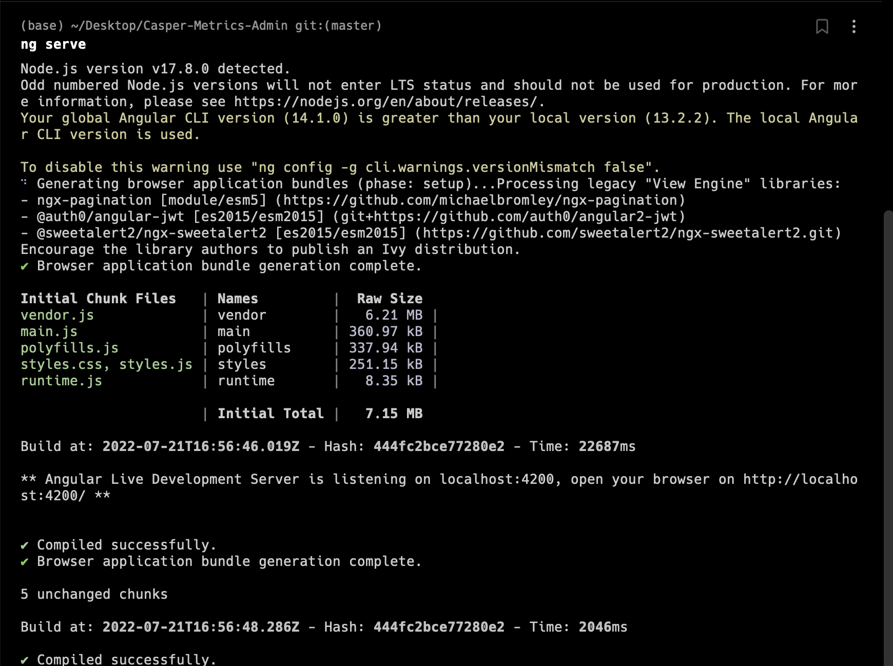
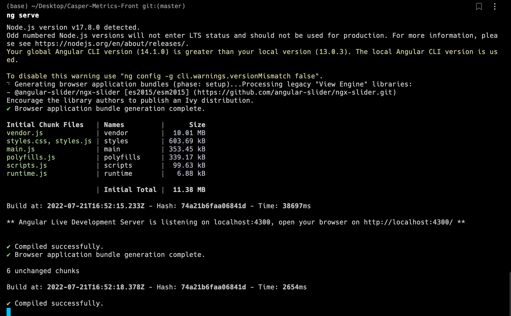
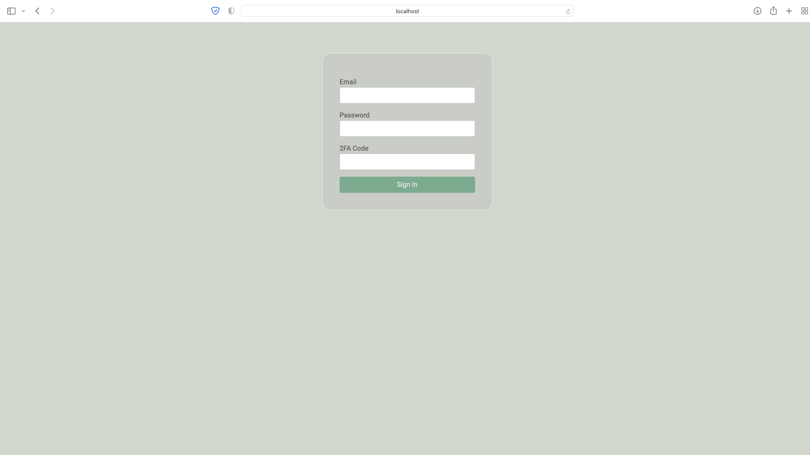
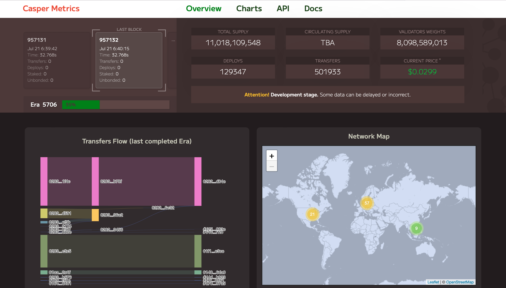
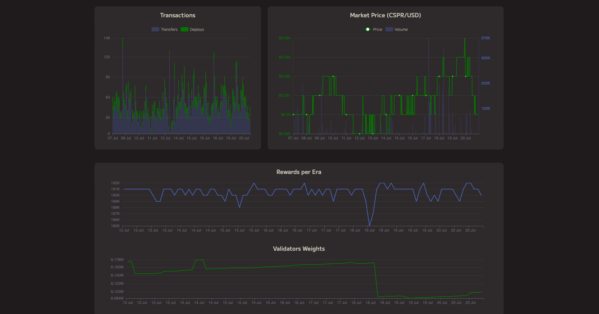
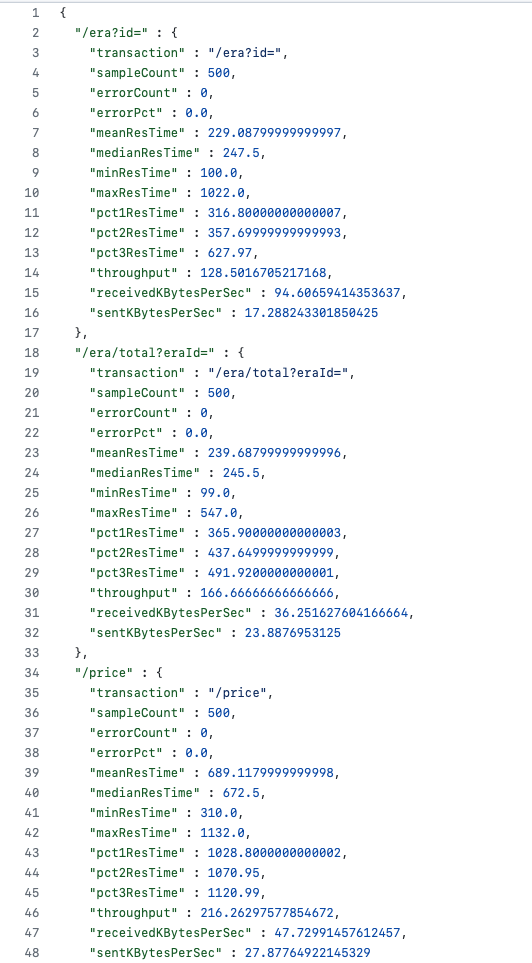
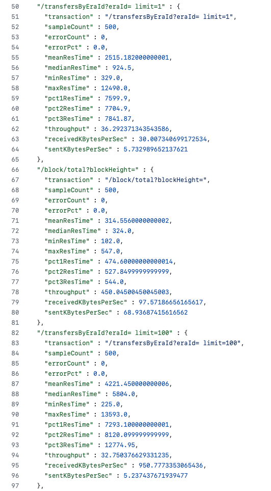
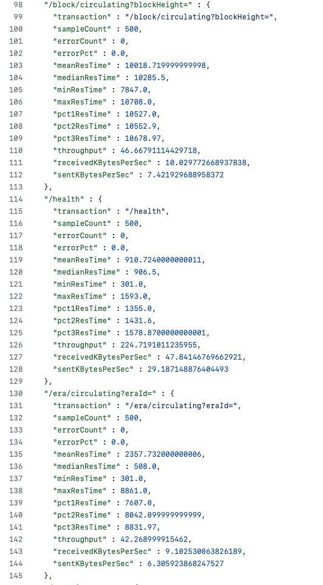
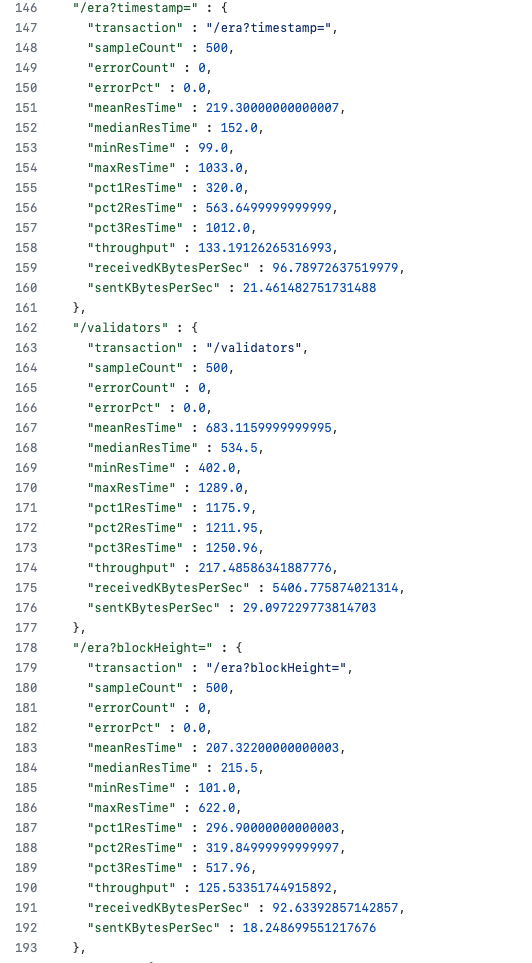
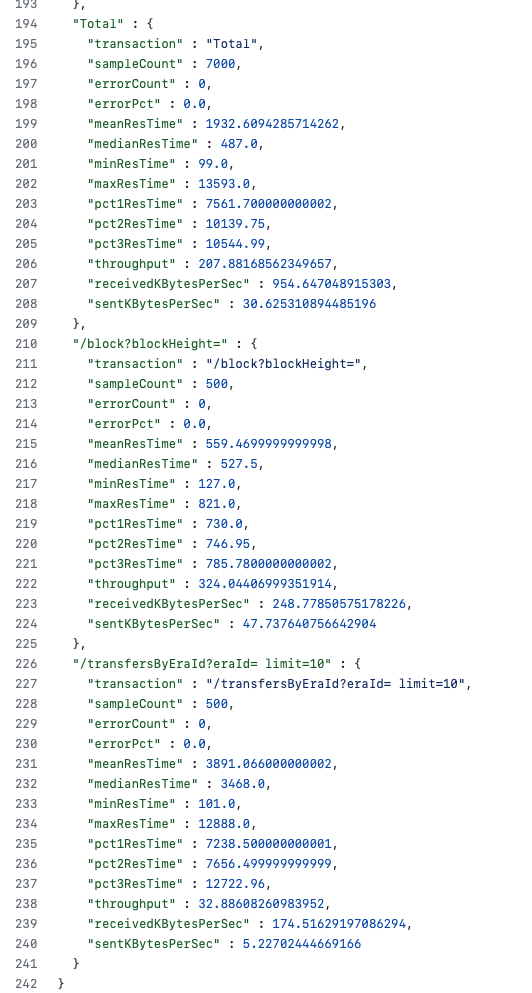

Grant Proposal | [86 - CSPR Metrics API and Historical Archive for Services, Daps and Analytics](https://portal.devxdao.com/app/proposal/86)
------------ | -------------
Milestone | 4
Milestone Title | Scalability and load
OP | Daniel Halford
Reviewer | Muhammed Didin <mdidin80@gmail.com>

# Milestone Details

## Details & Acceptance Criteria

**Details of what will be delivered in milestone:**

This Milestone is about load testing and making sure the system is production ready. All the changes are live in production and can be observed on [caspermetrics.io](https://caspermetrics.io) and the [API endpoints](https://mainnet.cspr.art3mis.net) accordingly.

- Improve load balancers and prepare for easy scaling when needed

- Load testing of the endpoints and static frontend. Estimate the amount of requests / connections per second, that system can handle without the need of scaling;

- Move the project to a performant dedicated server

- Add integration with the explorer, through any external explorer or by using SDK if needed

- Testing the load

**Acceptance criteria:**

API is ready for well enough load and provide data to users without visible restrictions.

## Milestone Submission

The following milestone assets/artifacts were submitted for review:

Repository | Revision Reviewed
------------ | -------------
https://github.com/a3mc/Casper-Metrics | 87c387c

# Install & Usage Testing Procedure and Findings

Following the [installation instructions in the repository]( https://github.com/a3mc/Casper-Metrics/blob/master/docs/INSTALLATION.md), 
the reviewer was able to run the project using the instruction guides specified. 

User Interface

## Overall Impression of usage testing

Following the instructions, the reviewer was able to build and run the project. The documentation provides sufficient installation and execution instructions. The reviewer thinks that project functionality meets the acceptance criteria and operates without errors.

Requirement | Finding
------------ | -------------
Project builds without errors | PASS
Documentation provides sufficient installation/execution instructions | PASS 
Project functionality meets/exceeds acceptance criteria and operates without error | PASS 

# End-to-End & Load Testing

Test reports are documented under the [reports folder](https://github.com/a3mc/Casper-Metrics/tree/master/e2e/Reports). 

It was observed that endpoints were tested in detail, and controls such as integer control, requirements control, timestamp validation control, era validation control, confirmation control, and filter control were added to the tests.
In addition, the tests are documented in detail.

Requirement | Finding
------------ | -------------
End-to-end tests | PASS
Load Tests | PASS

# Documentation

### Code Documentation

CRDAO code review standards states that low-level code documentation is a must. Although the codes are tried to be well documented in general, class-level code documentation is poor. Documentation should be added as a comment line at the beginning of classes, especially in important classes of important folders such as controllers, models, repositories and services. In addition to the code readability, it is also important for the preparation of auto-generated documentation. Particular attention should be paid to this issue as it is the fourth and final milestone of the project.

Requirement | Finding
------------ | -------------
Code Documented | FAIL

### Project Documentation

Project documents are added in the [docs folder](https://github.com/a3mc/Casper-Metrics/tree/master/e2e/Reports).

The reviewer observes that the project has detailed documentation  for usage with examples, along with the installation, build and test instructions, and documents are well structured.

Requirement | Finding
------------ | -------------
Usage Documented | PASS 
Example Documented | PASS 

## Overall Conclusion on Documentation

Although it is clear that importance is given to the project documentation, the reviewer observes that the documentation at the code level must be improved. The reviewer thinks that code documentation should fail, as the CRDAO review standards state that there should be code level documentation and this is the final milestone of the project.

# Open Source Practices

## Licenses

The Project is released under the MIT License.

Requirement | Finding
------------ | -------------
OSI-approved open source software license | PASS

## Contribution Policies

The project contains contribution and security policies and, a code of conduct.

Requirement | Finding
------------ | -------------
OSS contribution best practices | PASS 

# Coding Standards

## General Observations

Code is well structured and the project can be easily set up using the documentation via the Github repository. But, as this is the fourth and final milestone of the project, code-level documentation should be improved.

# Final Conclusion

The project provides the functionality described in the grant application and milestone acceptance criteria. Also, the project has extensive load and end-to-end tests. 

It is stated in the CRDAO standards that low-level code documentation is required but the project has poor code level documentation, especially for class level documentation. Moreover, the reviewer highly suggests that the shortcomings pointed out under the Coding Standards section shall be taken care of as it is the final milestone of the project.

Thus, in the reviewer opinion this submission should fail because of the reasons stated above.

# Recommendation

Recommendation | FAIL
------------ | -------------