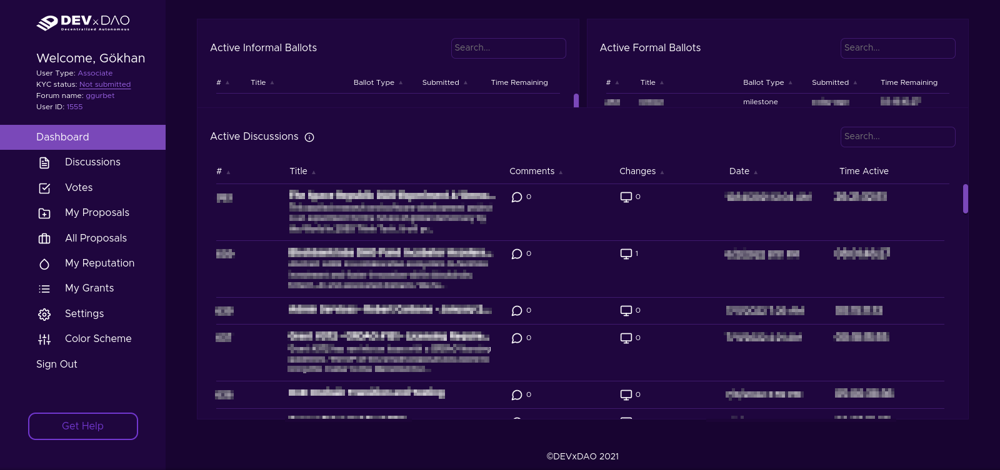
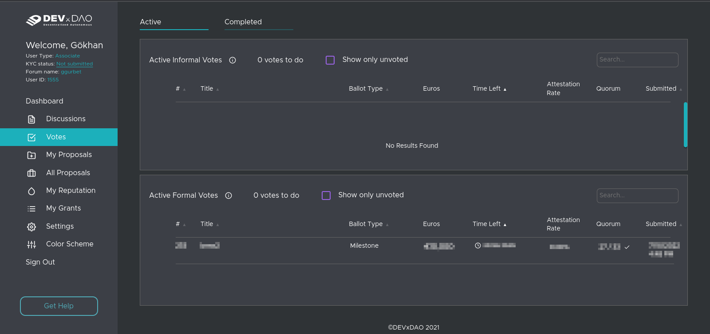
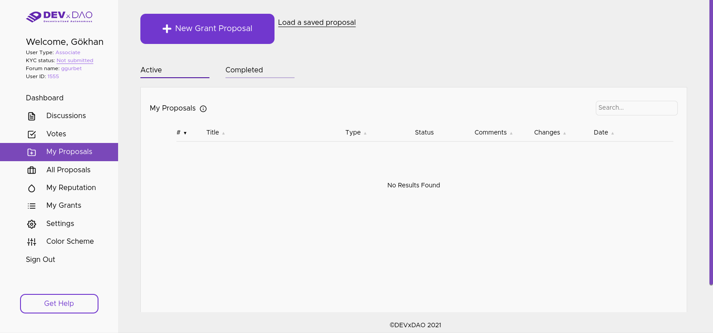
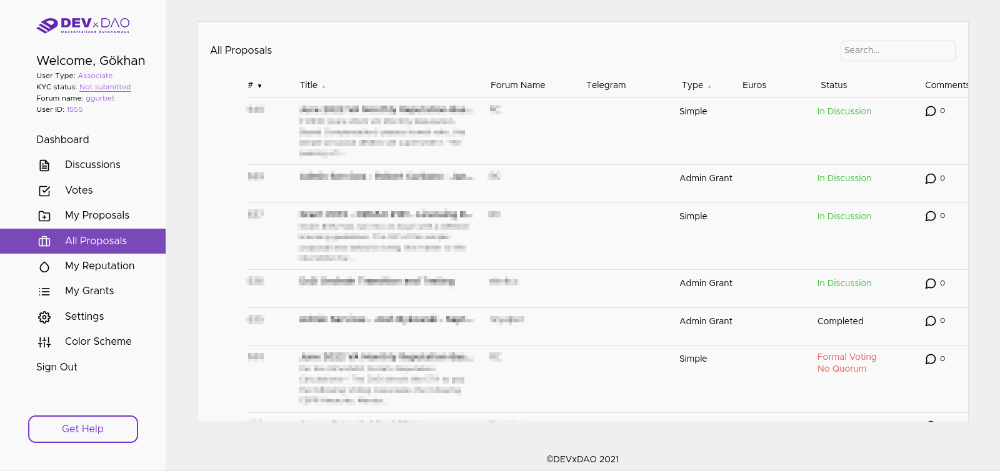
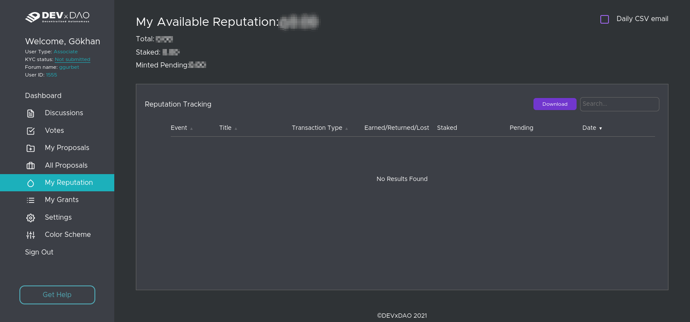
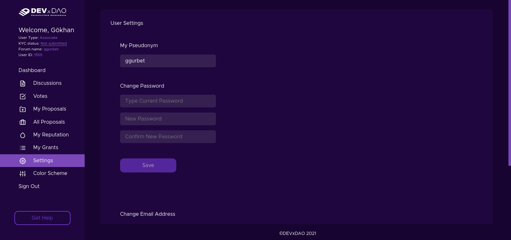

Grant Proposal | [DEVxDAO Portal Code](https://crdao.ossa.dev/Job-Detail/136)
------------ | -------------
Milestone | 1
Milestone Title | DEVxDAO Portal Code
OP | DEVxDAO <https://portal.devxdao.com/>
Reviewer | Gökhan Gurbetoğlu <crdao@ggurbet.com> & Yusuf Keten <ketenyusuf@gmail.com>

# Milestone Details

## Details & Acceptance Criteria

**Details of what will be delivered in milestone:**

Per resolution #583 (https://portal.devxdao.com/app/proposal/583) from the DEVxDAO, the CRDAO is requested to apply the standards of #196 (https://portal.devxdao.com/app/proposal/196) to the DEVxDAO's portal code, at the following URLs:

- https://github.com/ledgerleapllc/devxdao-frontend/
- https://github.com/ledgerleapllc/devxdao-backend/

**Acceptance criteria:**

DEVxDAO Portal Code will be checked against the Definition of Done defined in #196 as:

- The software's critical functionality is proven by at least one test case demonstrating successful completion.
- The software's critical functionality is enforced by at least one test case demonstrating expected failure when pre-conditions are violated.
- The software's critical functions are documented by idiomatic low-level comment blocks (ex: javadoc, rustdoc, godoc, etc).
- The software's external invocation layer (ex: API) adheres to idiomatic documentation standards as set forth by the language being used to create that layer.
- The software is free of any known defects that compromise critical functionality.
- The software is not in violation of any terms of its license.

## Milestone Submission

The following milestone assets/artifacts were submitted for review:

Repository | Revision Reviewed
------------ | -------------
https://github.com/ledgerleapllc/devxdao-backend/ | e6e0b6a
https://github.com/ledgerleapllc/devxdao-frontend/ | 78685d8

# Install & Usage Testing Procedure and Findings

Following the instructions in the provided README, reviewers were able to successfully build the source code without errors for these milestones on both a Pardus GNU/Linux 21.2 machine and an Ubuntu 20.04 GitPod instance. All corresponding logs are listed below.

- [Installation logs](assets/backend/install.md)
- [Setup logs](assets/backend/setup.md)

In terms of installation instructions, reviewers suggest that OP uses a uniform approach to manual installation instructions, since some parts of the instructions are not consistent with others (e.g. using `apt` and `apt-get` to install specific packages in the same way).

Usage of the project as a combination of backend and frontend is straightforward and works as intended. Users can use the portal effortlessly by the provided interfaces. Below is a mix of screenshots from the web interface:

**Dashboard**

**Votes**

**My Proposals**

**All Proposals**

**My Reputation**

**Settings**

*Note: Parts of images were pixelized to protect privacy.*

## Overall Impression of usage testing

Requirement | Finding
------------ | -------------
Project builds without errors | PASS
Documentation provides sufficient installation/execution instructions | PASS with Notes
Project functionality meets/exceeds acceptance criteria and operates without error | PASS

# Unit / Automated Testing

There are missing automated and/or unit tests throughout the projects.

Requirement | Finding
------------ | -------------
Unit Tests - At least one positive path test | FAIL
Unit Tests - At least one negative path test | FAIL
Unit Tests - Additional path tests | FAIL

# Documentation

### Code Documentation

Backend code has sufficient code documentation. Critical functions are well described with additional comments helping other programmers understand the code better.

However, the code in the frontend is essentially comment/documentation free. Although the code includes a few comments, most of them are just repetitition of the function names. Therefore, code comments are not sufficient.

Requirement | Finding
------------ | -------------
Code Documented | FAIL

### Project Documentation

On the backend, while the code hints at a possible documentation to be generated, there is no implementation for that.

On the frontend, the README.md file provides sufficient documentation on how to install and run the project. However, there is no detailed documentation on the project's architecture and other details.

Requirement | Finding
------------ | -------------
Usage Documented | FAIL
Example Documented | FAIL

## Overall Conclusion on Documentation

Given the number of FAILs above, the overall conclusion has to be that this project falls short of the expected level of documentation.

# Open Source Practices

## Licenses

Backend is released under the Apache-2.0 License.

Frontend is released under the Apache-2.0 License.

Requirement | Finding
------------ | -------------
OSI-approved open source software license | PASS

## Contribution Policies

Both backend and frontend contain clear CONTRIBUTING and SECURITY policies. SECURITY policies are referenced inside the CONTRIBUTING policies in both instances. Pull requests and Issues are enabled on the repositories and the projects are set up for public participation.

Requirement | Finding
------------ | -------------
OSS contribution best practices | PASS

# Coding Standards

## General Observations

Source code is well-written and thought out. It is easily readable. General best coding practices are used throughout the project.

# Final Conclusion

Projects have many missing parts, namely documentation and unit tests. Because of these, reviewers suggest a conclusion of FAIL.

# Recommendation

Recommendation | FAIL
------------ | -------------
